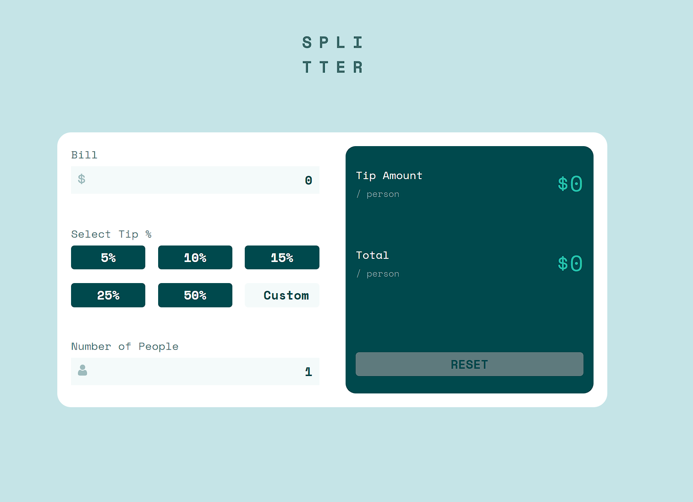

# Frontend Mentor - Tip Calculator App

This is a solution to the [Tip Calculator App challenge on Frontend Mentor](https://www.frontendmentor.io/challenges/tip-calculator-app-ugJNGbJUX). Frontend Mentor challenges help you improve your coding skills by building realistic projects.

## Table of Contents

- [Overview](#overview)
- [The challenge](#the-challenge)
- [Tech](#tech)
- [Screenshot](#screenshot)
- [Links](#links)

### Overview

Build out a tip calculator app and get it looking as close to the design as possible.

### The Challenge

Users should be able to:

- View the optimal layout for the app depending on their device's screen size
- See hover states for all interactive elements on the page
- Calculate the correct tip and total cost of the bill per person

### Tech

- React
- HTML
- Vanilla CSS
- Vercel

### Screenshot

### Links

- Solution URL: [Frontend Mentor Solution](https://www.frontendmentor.io/challenges/tip-calculator-app-ugJNGbJUX/hub/built-using-react-flexbox-and-css-modules-4b3IwEJWT)
- Live Site URL: [Vercel Link](https://tip-calculator-pdqu3hhcr-cjislegit.vercel.app/)

### Author

- Website - [Carlos Ramirez](https://cjramirez.tech/)
- Frontend Mentor - [@cjislegit](https://www.frontendmentor.io/profile/cjislegit)
- Twitter - [@cjram11](https://twitter.com/cjram11)
